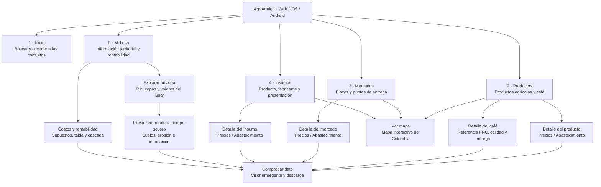
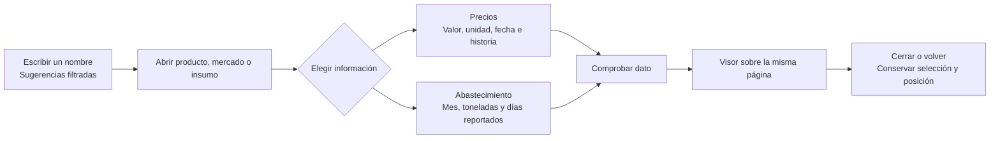
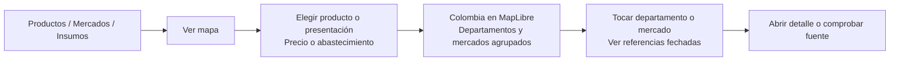
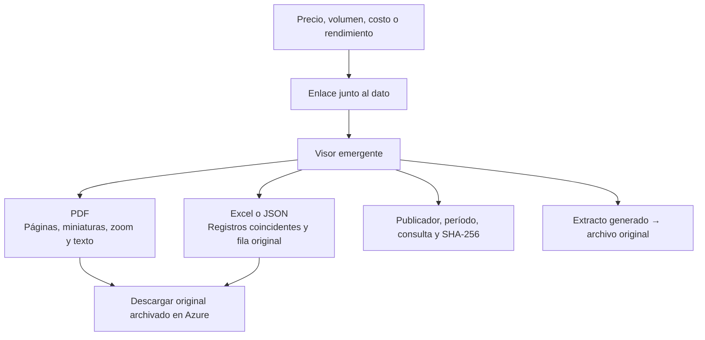
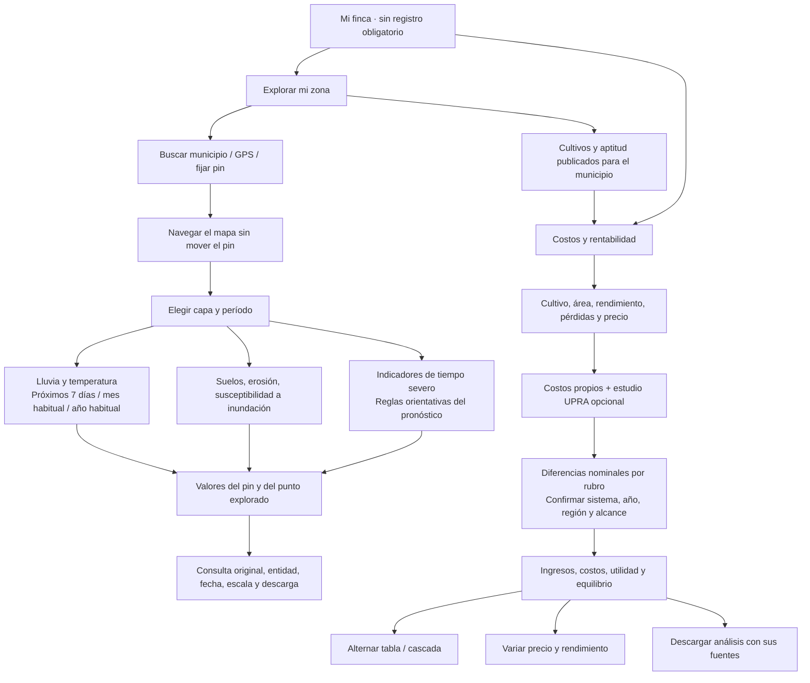
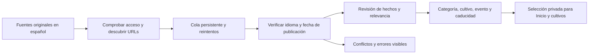

# Application and data architecture

The active product has a Next.js web app, an Android client and a Flutter iOS client using the same Azure origin. No Supabase dependency remains. Both mobile clients add native navigation, document downloads/sharing, JSON export and connection recovery without duplicating product logic. The iOS client retains the existing TestFlight app identity and uses WKWebView.

## Recorridos de usuario

Las cinco secciones son **Inicio, Productos, Mercados, Insumos y Mi finca**. Web, iOS y Android comparten la interfaz en español. Ya no existe un selector de comprador/agricultor.

| Sección | Ruta | Contenido |
| --- | --- | --- |
| Inicio | `/` | Búsqueda con sugerencias, accesos con imágenes, productos destacados y acceso a Mi finca. |
| Productos | `/products` | Filtros de departamento/categoría, favoritos y mapa. Detalle: `/product/[id]`. El café está en `/product/cafe-pergamino-seco`. |
| Mercados | `/markets` | Directorio con búsqueda y mapa. `/market/[id]` muestra precios de cada producto y volúmenes reportados. |
| Insumos | `/insumos` | Identidades y presentaciones comparables. `/insumo/[id]` muestra historia y comparación departamental. |
| Mi finca | `/farm` | Explorador territorial y análisis económico. `/farm/[id]` abre la ubicación anterior en el nuevo explorador. `/plan` y `/offers` mantienen seleccionada esta sección. |

**Mis guardados** está en el corazón del encabezado, en `/saved`. **Fuentes y ayuda** y **Créditos de imágenes** están en el encabezado o pie. No son pestañas adicionales. Un detalle conserva seleccionada su sección principal.

### Consultar precios y abastecimiento

El abastecimiento suma filas originales de DANE SIPSA-A por alimento, mercado de destino y mes. Muestra primera/última fecha y días con reportes. Un mes parcial se conserva parcial. Son **llegadas reportadas, no inventario disponible para comprar**. Los alimentos sin correspondencia exacta con el catálogo mantienen su nombre original; no se mezclan variedades por semejanza.

En insumos, **Abastecimiento** explica que SIPSA-I no publica inventarios de proveedores y permite consultar la cobertura de precios. El café pergamino y otros productos sin volúmenes comparables muestran esa ausencia. No se interpreta una serie ausente como cero producción.

### Abrir el mapa desde cada catálogo

Se incluyen los límites departamentales restaurados, una base OpenStreetMap, sombreado por departamento y agrupación de puntos. Se compara el mismo producto, fecha y unidad; el café conserva COP/125 kg. En insumos se conserva la presentación. El panorama de mercados cuenta referencias de productos, sin promediar precios de alimentos distintos. Los puntos de mercados son referencias municipales, no direcciones verificadas. Los controles del mapa están en español; sus dos módulos de trabajo se copian al preparar el build para que también se dibujen polígonos y puntos en Next.js/WebKit.

### Comprobar el origen de un dato

Azure PostgreSQL guarda copias inmutables de los documentos. Un PDF oficial se conserva intacto; un PDF generado por AgroAmigo se identifica como extracto y enlaza al libro original. Los XLSX se presentan con sus registros y descarga, sin fingir que son PDF. El visor conserva el foco, responde a Escape/Atrás y devuelve al elemento que lo abrió. `/evidence/[id]` permite enlaces directos.

### Mi finca: consultar el territorio y evaluar una idea

Mi finca se centra en información para decidir. El mapa funciona sin registrar cultivos ni organizar labores. Buscar un municipio centra la exploración; GPS o «Fijar mi pin aquí» establecen el punto. El pin guardado y el punto explorado tienen colores y resultados separados. Fijar un pin nuevo solicita confirmar el municipio usado para las referencias agrícolas; no se asigna municipio a partir del centroide más cercano. Los registros anteriores se conservan, y sus ubicaciones siguen disponibles.

**Capas verificadas y archivadas:** lluvia mensual/anual IDEAM 1991–2020, temperatura media mensual/anual IDEAM 1981–2010, correlación de suelos IGAC 1:100.000, erosión IDEAM 2020 1:100.000 y susceptibilidad a inundación IDEAM 2010 1:500.000. El mes se filtra por la fecha inicial de cada unidad del geoservicio. Una normal histórica no se presenta como pronóstico del mes de este año. La capa de suelos muestra paisaje; textura, profundidad, fertilidad, acidez y drenaje se consultan en la unidad del punto, sin fingir un análisis del predio.

Los próximos siete días se consultan en Open-Meteo. El mapa muestra hasta 25 puntos separados, con muestreo más cercano al acercarse, sin interpolarlos como mediciones continuas. Lluvia = suma del período; temperatura = máxima del período. El indicador de atención se activa si algún día supera los umbrales explicados (lluvia ≥20 mm, viento ≥40 km/h, máxima ≥35 °C o mínima ≤2 °C). Es una regla del producto, no una alerta oficial ni una probabilidad de daño. Datos ausentes no se convierten en cero ni en ausencia de amenaza. Las alertas oficiales se consultan mediante el enlace IDEAM.

El análisis económico trabaja con un cultivo, un año en producción para permanentes o un ciclo para transitorios. Calcula kilos vendibles, ingresos, costos por rubro, transporte, comisión, utilidad, margen y precio de equilibrio. Tabla y cascada derivan de las mismas fórmulas y admiten pérdidas. Los campos incompletos impiden mostrar un resultado engañoso. El usuario puede partir de los costos nominales de un estudio UPRA, editarlos y confirmar comparabilidad antes de ver diferencias; no se trata a los datos de 2023 como costos actuales ajustados por inflación.

EVA aporta rendimiento municipal y FEPCafé un costo nacional por kg de pergamino seco. El [CNA 2014 de DANE](https://microdatos.dane.gov.co/index.php/catalog/513) excluye costos de producción, precios e ingresos. [EMICRON 2024](https://microdatos.dane.gov.co/index.php/catalog/875/variable/F8/V147?name=P3057_D) agrupa gastos agrícolas, pecuarios y extractivos en un rubro que no permite asignar un costo por hectárea de este cultivo. No hay un ranking ni percentiles de utilidad de fincas vecinas. Las diferencias frente a UPRA son nominales y técnicas, con su región, año, sistema y PDF visibles.

El precio puede ser propio o una referencia estacional de al menos tres años completos. La comparación conserva el producto físico (caña no se valora como panela, arroz paddy no como arroz molido) y exige confirmar su equivalencia. El precio mayorista requiere revisar el descuento a finca. Los escenarios bajo/central/alto combinan cuartiles históricos con variación de rendimiento ingresada, manteniendo costos constantes para sensibilidad; no son probabilidades. [Detalles de fuentes y operación](MI_FINCA_DATA.md).

### Funcionalidad y límites

| Función | Dónde | Alcance |
| --- | --- | --- |
| Buscar y filtrar | Catálogos, mapas, fuentes y exploración de cultivos | Sugerencias sin distinción de tildes, teclado y botón para limpiar. |
| Precios actuales | Productos y mercados | Vista de últimos 12 meses, historia y fuentes. El precio mayorista no es una oferta en finca. |
| Café | Productos → Café pergamino seco | Referencia diaria FNC, factores de rendimiento, entregas, TRM y calculadora de oferta. Sin clasificación de compradores privados. |
| Abastecimiento | Producto / mercado | Volúmenes mensuales reportados, cobertura y filas originales; no existencias para venta. |
| Insumos | Detalle de insumo | Precios fechados de la misma presentación, sin dosis recomendadas ni ofertas de tiendas. |
| Transporte y ofertas | Producto, café y `/offers` | Comparar neto de venta y costo de compra con cantidades, descuentos, gastos, pago y vencimiento. Ofertas privadas ingresadas por el usuario. |
| Boletín diario | Producto → `/daily` | Definiciones diarias separadas de variedades mensuales, con PDF archivado. |
| Territorio y cultivos | Mi finca | Pin/GPS, seis capas temáticas, períodos, valores del punto y referencias municipales de cultivos. |
| Clima y alertas | Finca → Clima y labores | Pronóstico de siete días, reglas explicadas y publicaciones oficiales fechadas. No notificaciones push ni confirmación automática de plagas. |
| Qué sembrar | Finca → Mis cultivos → Explorar | Producción/rendimiento EVA, aptitud SIPRA y contexto regional de suelos. Sin diagnóstico de parcela. |
| Cosecha y estacionalidad | Presupuesto | Calendarios históricos, ventana según floración de café y simulación por ciclo. No determina madurez de cosecha. |
| Guardar y exportar | Mi finca | Pin local persistente; descarga del análisis económico con supuestos, resultados y fuentes. Los registros anteriores se conservan. |
| Fotografías e ilustraciones | Catálogos y créditos | Fotografías por familia, plazas conocidas y material ilustrativo. Se distinguen ilustraciones y empaques genéricos. |

Pendiente de desarrollo: red de ofertas en vivo, pagos verificados, notificaciones push, fechas de siembra óptimas automáticas, aptitud de parcela, satélites, rutas de transporte, análisis CHIRPS e integración de modelos AGRORAC. Las notas de investigación no implican que esas funciones estén activas.

### Mapa de implementación

| Responsabilidad | Ubicación |
| --- | --- |
| Navegación y catálogos | `app/app-shell.tsx`, `app/page.tsx`, `components/marketplace/CatalogView.tsx`, `app/markets`, `app/insumos` |
| Detalles | `app/product/[id]`, `app/market/[id]`, `app/insumo/[id]`, `components/explore/CoffeeDetail.tsx` |
| Abastecimiento y mapas | `components/explore/SupplyPanel.tsx`, `ColombiaMap.tsx`, `lib/server/explore.ts`, `/api/explore/[resource]` |
| Búsqueda y visor | `components/ui`, `components/planning/EvidenceProvider.tsx`, `EvidenceContent.tsx`, `PdfViewer.tsx` |
| Mi finca informativa | `app/farm`, `components/location`, `lib/location-types.ts`, `lib/cleansheet.ts` |
| Capas y evidencia territorial | `lib/server/location.ts`, `api/location/[resource]`, `pipelines/spatial` |
| Compatibilidad de datos anteriores | `lib/farm-types.ts`, `components/planning/FarmContext.tsx` |
| Planificación | `app/plan`, `components/planning/WeeklyPlan.tsx`, `CropOptions.tsx`, `CropBudget.tsx`, `lib/planning-math.ts` |
| Imágenes | `lib/images.ts`, `lib/image-library.json`, `app/credits`, `pipelines/assets` |
| Importación inicial de abastecimiento | `pipelines/market` |
| Ingesta permanente | `pipelines/ingestion`, `infra/deploy_ingestion.py` |

Las rutas de código web son relativas a `apps/web/src`. `/coffee` redirige al producto café y `/map` al catálogo de mercados. `/auth` y `/settings` conservan redirecciones de compatibilidad.

## Server boundary

`apps/web/src/lib/server` is server-only. PostgreSQL connections use certificate validation, a small pooled connection limit and statement timeout. Parameterized API queries validate/limit inputs and return plain Spanish errors without SQL or connection details. The application role can SELECT reference tables and INSERT public weather snapshots; it cannot modify official data or documents.

`source_document` holds original PDF/XLSX/JSON/text bytes. `document_alias` points to a current version, while observation records and saved scenarios link to immutable hashes. DANE's original price source is XLSX: generated PDFs explicitly identify themselves as AgroAmigo extracts and retain workbook/sheet/row locators plus links to the original workbook. Original official PDFs are archived intact. PDF.js renders locally inside the app with bundled worker/fonts; non-PDF source data can show relevant records and preserve a downloadable original.

Observation guards reject future Colombia dates. Historical observations are retained permanently; the app defaults to recent 12-month views with dates visible and retained historical supply months available, and planning selects five complete prior years from the retained `seasonal_year` history. The `historical_price` table preserves original source rows and units; `retained_record` preserves revisions of published observations. Triggers block deletion/truncation of historical stores, and the ingestion role has no deletion or DDL privileges. Crop reference data is not represented as a current observation. Prices are nominal. No interpolation fills missing source rows.

## Local data

Farm records, crops, saved products, quotes, task status and up to six scenarios per farm are stored on the user's device. They are not uploaded or published. Climate requests from the informational workspace preserve six-decimal farm coordinates to the server/provider and store the public forecast response for provenance. Municipal default points are explicitly distinguished from a farm location. User-entered dates and yields are assumptions or records, not remotely verified facts.

The informational workspace stores the exact pin, municipality, name, location method and linked active farm in `agroamigo-location-v1`; it synchronizes the point to the active `agroamigo-farms-v2` profile while preserving crop plans and budgets. Municipality selection never creates or moves the farm point. Map placement and GPS retain their provenance; imported legacy coordinates remain readable; weather requests preserve six-decimal coordinates. Economic assumptions stay in the session and export to JSON. Point GIS queries send six-decimal coordinates to the public source and archive query/response envelopes in Azure `spatial_snapshot`, with SHA-256 and source schema parents. Forecast requests archive both requested and model coordinates. Legacy farm storage uses `agroamigo-farms-v2`. The existing `agroamigo-farm-v1` is migrated once with stable identifiers, and old scenario snapshots remain accessible on that migrated farm. Budgets are applied explicitly to one crop. Weather task status is scoped to farm/crop. Location permission is requested only by the GPS button; permission denial keeps map placement available. The saved pin appears on every farm detail. JSON exports carry the farm, crop plans and source identifiers; there is no account-based device synchronization.

## Noticias: investigación y clasificación

El catálogo contiene 95 fuentes candidatas en español, de ocho grupos: organismos colombianos, investigación y gremios, medios nacionales especializados, medios regionales y tres grupos internacionales, además del grupo internacional original. Hay 88 candidatos habilitados para comprobación de acceso; su inclusión no demuestra cobertura completa ni derechos de publicación. Una noticia internacional puede ser pertinente por precios, insumos, comercio, logística o clima sin mencionar Colombia. Los efectos locales inferidos se identifican por separado de los hechos publicados.

`pipelines/news` conserva enlaces, extractos breves de titulares, fechas, hashes, revisiones y estado en SQLite; no guarda cuerpos de artículos ni imágenes. La selección limita la repetición de editor y evento. Precios puntuales y alertas operativas caducan a las 48 horas; análisis de mercado a los siete días; noticias generales y perspectivas estacionales a los 14 días. Las alertas y perspectivas se revisan a diario cuando se ejecuta el recolector. La caducidad de una noticia no declara terminado un riesgo.

El recolector funciona localmente y tiene pruebas en CI. **La tarea diaria de Luna en la nube sigue preparada, sin ID de tarea ni próxima ejecución verificados.** La salida es investigación privada: falta conectar el ejecutor, revisión y entrega autorizada a Azure antes de activar noticias públicas en Inicio y los detalles. [Operación y límites](../pipelines/news/README.md), [estado de la tarea](automation/README.md), [investigación internacional verificada](research/news-global-spanish-2026-09-08/README.md).

## Refresh and deployment

Azure Function `agroamigo-data-9a04` refreshes official price sources daily at 23:00 UTC (18:00 Colombia) and resumes historical extraction hourly at minute 15. It uses the existing subscription, App Service plan and PostgreSQL database. Original source bytes also reside in the private `agroamigodata9a04/source-archive` container without expiration. PostgreSQL storage autogrow is enabled. SIPSA monthly coverage begins in July 2012, and the first daily source is dated 12 June 2012. See [the ingestion service](../pipelines/ingestion/README.md) for checkpoints, retention controls and operational validation. Other planning references remain dated publications; climate is fetched on use.

Web deployment bundles the standalone server, static assets, PDF worker assets and APK. It excludes dotenv credentials and verifies both an artifact-specific release ID and the database health endpoint.

GitHub Actions builds web, Android and iOS, checks Python syntax and news-pipeline behavior, runs Android lint and checks iOS navigation rules. The retained `agroamigo-iphone-build.yml` workflow runs on every push/PR; successful builds on `main` automatically sign and upload to TestFlight using the existing native-app secrets. Other branches and pull requests only build. Web deployment remains a separate Azure operation. End-to-end browser tests need the configured Azure database or `PLAYWRIGHT_BASE_URL`; iOS integration tests use the live Azure demo in a simulator.

GitHub build artifacts use one-day retention. Only successful main-branch Android installers and successfully uploaded TestFlight IPAs are archived; unsigned Runner.app folders are not uploaded. `artifact-cleanup.yml` runs after either build workflow, daily, and on manual request. It keeps at most the newest successful main artifact per platform, removes superseded/expired/older-than-one-day copies and retired build formats, and leaves running workflows and unrelated artifacts alone. The daily pass also covers artifacts created under the old 90-day policy. Dependency caches remain available to speed up builds. The cleanup does not delete workflow history or store releases. Preview it with `python3 .github/scripts/prune_artifacts.py`; add `--apply` to delete the listed artifacts.

## Cleanup record

The active Flutter iOS client was moved from `agroamigo-iphone` to `apps/ios`, its old Supabase screens were replaced with the shared Azure interface, and its existing successful TestFlight workflow was retained with updated paths. The old Expo/React Native and second Next web prototypes, Expo release workflow and unused shared Supabase package were removed. Twenty unreachable components, providers, translation/map modules and Supabase initializers were removed from the active web app. Legacy Supabase migrations, one-off repair scripts and its ingestion stack were replaced by the independent Azure importers. Unused raw municipality duplicates were removed after retaining the active application datasets; old implementations remain available in Git history.

## Shared visual design

`apps/web/src/app/globals.css` provides component layout and responsive behavior; `field-theme.css` defines the shared colors, photographic headers, crop cards, alert treatments and mobile refinements. All three clients load this same product interface. The iOS deployment target is iOS 18, matching the supported PDF viewer browser baseline. The Flutter client passes its measured bottom inset to the trusted page as `--agro-safe-bottom`, reapplied after navigation and viewport changes; CSS falls back to browser safe-area values. This covers embedded WKWebView layouts that report a zero CSS inset. PDF text uses explicit stream readers for older WebKit versions without asynchronous stream iteration.

Typography uses standard platform fonts without downloaded display fonts. Solid fills, visible borders, larger labels and simple corners keep the interface familiar. The five mobile destinations share equal grid columns and the same parent-route selection rules as desktop navigation. Short pages fill the dynamic viewport; landscape phones retain mobile navigation.

The iOS WebView fills a Stack below the top safe area and extends to the bottom screen edge. Loading is an overlay and there is no separate native back-button row to change the page height after navigation. The web viewport uses `viewport-fit=cover`; the tab bar adds `env(safe-area-inset-bottom)` so its background reaches the edge while controls clear the home indicator. This follows [WebKit's safe-area guidance](https://webkit.org/blog/7929/designing-websites-for-iphone-x/). Page back buttons and native swipe gestures remain available.

## Release validation

The [8 September release report](RELEASE_VALIDATION_2026-09-08.md) records native Android/iPhone UI coverage, source-query reconciliation, final release identity, observed cold-read limitations and the separate news-scheduler status.
