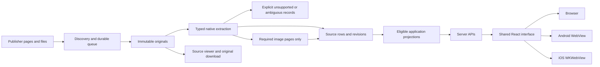

# Application and data architecture

AgroAmigo has a Next.js application and two mobile clients that load the same interface. Android uses WebView; the Flutter iOS client uses WKWebView. Product behavior and data queries live in the shared web application. Native shells provide navigation, location permissions, downloads, sharing and connection recovery.

## Application flow

| Section | Routes | Behavior |
|---|---|---|
| Inicio | `/` | Search and entry points into the catalog and local references |
| Productos | `/products`, `/product/[id]`, `/references/[id]` | Canonical products and official quote identities, dated prices, history and sources |
| Mercados | `/markets`, `/market/[id]` | Market quotations and reported supply |
| Insumos | `/insumos`, `/insumo/[id]` | Commercial input identities and comparable presentations |
| Mi finca | `/farm`, `/farm/[id]`, `/plan` | Location, weather, territorial context and read-only crop references |

`/saved` holds favorites, `/offers` compares privately entered offers, `/sources` explains data and methods, and `/credits` attributes images. `/evidence/[id]` provides a direct source view; the same viewer can open over a detail page.

Mi finca has no manual profitability or crop-budget editor. Legacy budget links open published references, and earlier farm/scenario data remains stored. The useful FNC quantity conversion and offer calculations remain separate features.

## From an official source to a screen

```mermaid
flowchart LR
    Source[Publisher pages and files] --> Queue[Discovery and durable queue]
    Queue --> Archive[Immutable originals]
    Archive --> Parser[Typed native extraction]
    Parser --> History[Source rows and revisions]
    Parser --> Review[Explicit unsupported or ambiguous records]
    Parser --> OCR[Required image pages only]
    OCR --> History
    History --> Projection[Eligible application projections]
    Projection --> API[Server APIs]
    API --> Web[Shared React interface]
    Web --> Browser[Browser]
    Web --> Android[Android WebView]
    Web --> iOS[iOS WKWebView]
    Archive --> Viewer[Source viewer and original download]
```

Source bytes are identified by SHA-256 and retained in PostgreSQL and private Azure Blob Storage. Changed bytes at the same URL create a new original. Parsed observations retain document, sheet/page/row, original unit and reporting period. A generated extract is labelled as derived and links to its original.

Native parsing precedes OCR. Only supported failed layouts can publish through a typed OCR adapter, with independent readings and source-specific validation. Retaining an image or extracted text does not imply that its prices have been published. Missing dates, conflicting identities and unsupported units remain reviewable.

Historical observations are retained. Published views apply source review, parser revision and date eligibility rules. Canonical prices, package quotations, weekly means, milk farmgate prices and international benchmarks keep their distinct units and bases. The frontend uses bounded queries, caches and current read models rather than rebuilding every history on each request.

## Server and storage boundaries

`apps/web/src/lib/server` owns database access and server-only queries. APIs validate their filters and use parameterized SQL. The web role reads published data and can retain public weather/spatial responses; ingestion uses a separate restricted writer. Credentials stay on the server.

| Store | Responsibility |
|---|---|
| `source_document` and source relationships | Immutable originals, derived evidence and parentage |
| `historical_price` and source-specific raw tables | Source observations and parser revisions |
| Price, input and supply projections | Eligible data for the application |
| `official_price_quote` / `official_catalog_current` | Distinct reference identities and a small current catalog |
| Ingestion queue and checkpoints | Retry, bounded execution and durable resume |
| Weather and spatial snapshots | Public model/geographic responses with query provenance |

## Location and private data

Farm locations, saved products and private offers are stored on the device. Browser, Android and iOS storage are separate. There is no account-based synchronization of these records. Existing farm and scenario storage is preserved when using the read-only reference views.

A saved farm pin is distinct from an explored map point or municipal reference center. Forecast and spatial requests send the selected coordinates to the server and relevant public provider; their responses are retained for provenance. Regional maps and municipal soil summaries do not establish parcel conditions.

## Execution and delivery

Azure Functions performs recurring discovery, recent refreshes, historical backfill and bounded OCR recovery. A shared advisory lock prevents overlapping writers; checkpoints allow interrupted work to resume. Timer schedules and execution budgets are configured separately from source adapters.

The Azure web deployment packages the Next.js standalone server and local viewer/map assets. Mobile packages contain the native shells and load the hosted application. The iOS workflow builds the client and supports signed TestFlight delivery. Shared interface changes and native-shell changes therefore have separate delivery paths.

The independent Spanish news collector is runnable locally but is not connected to a cloud news scheduler or public app feed. Its editorial records are separate from agricultural price observations.

See [code navigation](CODE_NAVIGATION.md), [ingestion](../pipelines/ingestion/README.md), [infrastructure](../infra/README.md) and [data sources](DATA_SOURCES.md).
