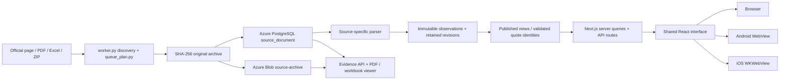

# Code navigation

Start here to locate an implementation. [Architecture](ARCHITECTURE.md) explains the product; [ingestion operations](../pipelines/ingestion/README.md) explains the recurring worker. Paths below are relative to the repository root.

## Follow one price from its source to the screen

The worker archives originals before parsing. A changed file at the same URL receives a new content hash. Existing observations retain their original document identifiers. OCR is a fallback for unreadable text or image tables and preserves its rendered input and independent readings. `pdf_sources.py` owns shared verified-page handling; `city_reports.py` reconstructs the entire city document to retain date, market, classification and page identity when a continuation table requires OCR. `test_city_ocr_fallback.py` covers real PDF objects with native headings, image-only prices and logos.

## Repository map

| Area | Entry points | Responsibility |
| --- | --- | --- |
| Shared application | [apps/web/src/app](../apps/web/src/app), [apps/web/src/components](../apps/web/src/components) | Next.js routes and React screens used by all three clients. |
| Server boundary | [apps/web/src/lib/server/db.ts](../apps/web/src/lib/server/db.ts) | Certificate-verified database connections and the default recent-date window. Other files in this directory contain server-only queries. |
| Recurring ingestion | [pipelines/ingestion/function_app.py](../pipelines/ingestion/function_app.py), [worker.py](../pipelines/ingestion/worker.py), [queue_plan.py](../pipelines/ingestion/queue_plan.py) | Azure timers, persistent source queue, HTTP revalidation, source archival, parser dispatch and bounded scheduling. |
| Initial/manual imports | [pipelines/demo](../pipelines/demo), [pipelines/market](../pipelines/market), [pipelines/planning](../pipelines/planning), [pipelines/spatial](../pipelines/spatial) | Initial catalog, supply, dated planning publications and territorial layers. The recurring worker is the unattended refresh path. |
| Schema | [pipelines/demo/schema.sql](../pipelines/demo/schema.sql), [pipelines/market/schema.sql](../pipelines/market/schema.sql), [pipelines/planning/schema.sql](../pipelines/planning/schema.sql), [pipelines/spatial/schema.sql](../pipelines/spatial/schema.sql), [pipelines/ingestion/schema.sql](../pipelines/ingestion/schema.sql) | Application tables, evidence, regional observations, official references, retention triggers and published views. |
| Azure deployment | [infra/provision.py](../infra/provision.py), [infra/deploy.py](../infra/deploy.py), [infra/deploy_ingestion.py](../infra/deploy_ingestion.py), [infra/app_settings.py](../infra/app_settings.py) | Resource setup, web/worker packaging, release verification and preservation of remote operator settings. |
| Android shell | [apps/android/app/src/main/java/co/agroamigo/demo/MainActivity.java](../apps/android/app/src/main/java/co/agroamigo/demo/MainActivity.java) | Trusted-origin WebView, native back, location permission, downloads and connection recovery. |
| iOS shell | [apps/ios/lib/main.dart](../apps/ios/lib/main.dart), [apps/ios/ios](../apps/ios/ios) | Flutter WKWebView, safe-area handling, trusted navigation, location permission and native source sharing. |

## Source adapters and data stores

| Source or operation | Implementation | Stored/public output |
| --- | --- | --- |
| DANE consolidated monthly, monthly annexes, daily Excel, FNC | [pipelines/ingestion/worker.py](../pipelines/ingestion/worker.py) | `historical_price`, then application price/coffee tables; publication guards retain older revisions. |
| DANE input prices and ancillary annexes | [inputs.py](../pipelines/ingestion/inputs.py), [input_references.py](../pipelines/ingestion/input_references.py) | Department/municipality prices in `input_price` / `input_municipal_price`; production factors, costs and other context in `input_reference_row`. Context is not relabeled as a quoted input price. |
| DANE PDF extraction | [pdf_sources.py](../pipelines/ingestion/pdf_sources.py) | Versioned native text/tables in `source_pdf_page`, parsed observations with page/row locators. |
| City reports inside ZIPs | [city_reports.py](../pipelines/ingestion/city_reports.py) | ZIP and individual PDFs, `source_archive_member`, `regional_price`, `regional_classification`; package quantity, unit, price round and category path stay explicit. |
| Raw milk and mill rice/byproducts | [special_prices.py](../pipelines/ingestion/special_prices.py) | Separate farm/mill price series and units, then validated app projections. |
| Supply | [supply.py](../pipelines/ingestion/supply.py) | Source-grounded monthly `supply_observation`; reported arrivals are not inventory. |
| Official Colombian alternatives | [colombia_sources.py](../pipelines/ingestion/colombia_sources.py), [official_sources.py](../pipelines/ingestion/official_sources.py) | `official_price_quote`, `official_source_review`, `published_official_price`. See [verified Colombian sources](OFFICIAL_COLOMBIA_SOURCES.md). |
| Official international references | [international_sources.py](../pipelines/ingestion/international_sources.py), [official_sources.py](../pipelines/ingestion/official_sources.py) | Same explicit reference schema, keeping currency, origin, destination market and basis. See [international sources](OFFICIAL_INTERNATIONAL_SOURCES.md). |
| OCR | [ocr.py](../pipelines/ingestion/ocr.py), adapter `parse_with_ocr` methods | `source_ocr_scan/task/result/attempt`, immutable rendered images, supported validated observations; uncertainty stays reviewable. |
| Original workbook display | [workbook_preview.py](../pipelines/ingestion/workbook_preview.py) | Read-only paginated XLS/XLSX cells, worksheet names and source dimensions. No editing or formula execution. |

All adapter filenames in this table are under [pipelines/ingestion/](../pipelines/ingestion). Look up `worker.parser_version(kind)` when changing a parser, and inspect queue eligibility as well as the parser itself. A deployed code change only repairs an old document after that document is selected and reprocessed. Immutable result identity must distinguish parser revisions.

## APIs and visible features

All paths in this table are under [apps/web/src/](../apps/web/src).

| Feature | API / server implementation | Screen / component |
| --- | --- | --- |
| Unified catalog selection | [lib/server/catalog.ts](../apps/web/src/lib/server/catalog.ts), [catalog-types.ts](../apps/web/src/lib/catalog-types.ts), [catalog-display.ts](../apps/web/src/lib/catalog-display.ts) | Shared search, exact quote/saved identities, bounded caching, visible currency/unit/basis, and catalog return filters. [catalog.spec.ts](../apps/web/tests/catalog.spec.ts) verifies the unified flow; [home-catalog.spec.ts](../apps/web/tests/home-catalog.spec.ts) checks exact home suggestion links and image failure recovery; [catalog-budget-compatibility.spec.ts](../apps/web/tests/catalog-budget-compatibility.spec.ts) guards COP/kg budget inputs. |
| Monthly summary price selections | [lib/server/summary-references.ts](../apps/web/src/lib/server/summary-references.ts), [AdditionalProductPrices.tsx](../apps/web/src/components/marketplace/AdditionalProductPrices.tsx) | Exact published names/cities/units; footnoted names stay separate. Canonical product detail exposes matching summary quotes; other names enter the main catalog. |
| Product catalog and detail | [app/api/catalog/route.ts](../apps/web/src/app/api/catalog/route.ts), [app/api/products/[id]/route.ts](../apps/web/src/app/api/products/[id]/route.ts); [lib/server/queries.ts](../apps/web/src/lib/server/queries.ts), [price-quotes.ts](../apps/web/src/lib/server/price-quotes.ts) | [app/page.tsx](../apps/web/src/app/page.tsx), [app/product/[id]/page.tsx](../apps/web/src/app/product/[id]/page.tsx), [components/marketplace/CatalogView.tsx](../apps/web/src/components/marketplace/CatalogView.tsx), [PriceChart.tsx](../apps/web/src/components/marketplace/PriceChart.tsx). |
| Consistent market/package/unit filters | [lib/server/price-quotes.ts](../apps/web/src/lib/server/price-quotes.ts) defines `PRICE_QUOTES` and `filteredProduct` | [components/explore/AppliedFilters.tsx](../apps/web/src/components/explore/AppliedFilters.tsx); product detail passes the same selected identities to current price, history and comparison. |
| City PDFs and classifications | `PRICE_QUOTES` combines regional observations and classifications; `/api/planning/regional` | [components/explore/CityPrices.tsx](../apps/web/src/components/explore/CityPrices.tsx), [app/regional/page.tsx](../apps/web/src/app/regional/page.tsx). |
| Input context and national monthly summaries | [app/api/data-references/route.ts](../apps/web/src/app/api/data-references/route.ts) | [app/data-references/page.tsx](../apps/web/src/app/data-references/page.tsx); source summary, electricity and monthly wholesale rows remain distinct from individual quotes. |
| Product and input maps | [app/api/explore/[resource]/route.ts](../apps/web/src/app/api/explore/[resource]/route.ts), [lib/server/explore.ts](../apps/web/src/lib/server/explore.ts) | [components/explore/ColombiaMap.tsx](../apps/web/src/components/explore/ColombiaMap.tsx); selected map points show dated quotes. |
| Markets and individual inputs | `/api/explore/market`, `/api/explore/input`; [explore.ts](../apps/web/src/lib/server/explore.ts), [planning.ts](../apps/web/src/lib/server/planning.ts) | [app/markets](../apps/web/src/app/markets), [app/market/[id]](../apps/web/src/app/market/[id]), [app/insumos](../apps/web/src/app/insumos), [app/insumo/[id]](../apps/web/src/app/insumo/[id]); [components/comparison/MarketPrices.tsx](../apps/web/src/components/comparison/MarketPrices.tsx). |
| Matched market/input comparison | [app/api/compare/[kind]/route.ts](../apps/web/src/app/api/compare/[kind]/route.ts), [lib/server/comparisons.ts](../apps/web/src/lib/server/comparisons.ts), [lib/comparison-math.ts](../apps/web/src/lib/comparison-math.ts) | [app/compare/markets](../apps/web/src/app/compare/markets), [app/compare/inputs](../apps/web/src/app/compare/inputs), [components/comparison/ComparisonWorkspace.tsx](../apps/web/src/components/comparison/ComparisonWorkspace.tsx), `ComparisonRowCard.tsx`. Compare only matching product, presentation, unit and source basis. |
| Official reference catalog/history | [app/api/references/route.ts](../apps/web/src/app/api/references/route.ts), [lib/server/official-references.ts](../apps/web/src/lib/server/official-references.ts), [lib/official-types.ts](../apps/web/src/lib/official-types.ts) | [app/references/page.tsx](../apps/web/src/app/references/page.tsx), [app/references/[id]/page.tsx](../apps/web/src/app/references/[id]/page.tsx). A quote key identifies one compatible series; unlike currencies or price bases are not pooled. |
| Evidence metadata and originals | [app/api/evidence/[id]/route.ts](../apps/web/src/app/api/evidence/[id]/route.ts), `content/route.ts`; [lib/server/planning.ts](../apps/web/src/lib/server/planning.ts), [source-storage.ts](../apps/web/src/lib/server/source-storage.ts) | `EvidenceProvider.tsx`, `EvidenceLink.tsx`, `EvidenceContent.tsx`, `PdfViewer.tsx`, `WorkbookViewer.tsx` in [components/planning/](../apps/web/src/components/planning); direct route [app/evidence/[id]](../apps/web/src/app/evidence/[id]). |
| Excel source preview | [app/api/evidence/[id]/workbook/route.ts](../apps/web/src/app/api/evidence/[id]/workbook/route.ts) proxies the worker's `/api/workbook/{id}` | [components/planning/WorkbookViewer.tsx](../apps/web/src/components/planning/WorkbookViewer.tsx); original download remains available. |
| FNC coffee specifics | [app/api/coffee/route.ts](../apps/web/src/app/api/coffee/route.ts), [lib/server/queries.ts](../apps/web/src/lib/server/queries.ts) | [components/explore/CoffeeDetail.tsx](../apps/web/src/components/explore/CoffeeDetail.tsx); per-125 kg reference and quality/yield factors remain distinct from wholesale kilograms. |
| Mi finca map and location | [app/api/location/[resource]/route.ts](../apps/web/src/app/api/location/[resource]/route.ts), [lib/server/location.ts](../apps/web/src/lib/server/location.ts) | [components/location/LocationWorkspace.tsx](../apps/web/src/components/location/LocationWorkspace.tsx), `LocationMap.tsx`, `FarmPointEditor.tsx`, `ZoneExplorer.tsx`. |
| Farm budgets and source assumptions | [app/api/planning/[resource]/route.ts](../apps/web/src/app/api/planning/[resource]/route.ts), [lib/server/planning.ts](../apps/web/src/lib/server/planning.ts), [lib/planning-math.ts](../apps/web/src/lib/planning-math.ts) | [components/planning/CropBudget.tsx](../apps/web/src/components/planning/CropBudget.tsx), `CropOptions.tsx`; methodology in [Mi finca data](MI_FINCA_DATA.md). |
| Navigation, credits and common style | [app/app-shell.tsx](../apps/web/src/app/app-shell.tsx), [app/layout.tsx](../apps/web/src/app/layout.tsx), [app/providers.tsx](../apps/web/src/app/providers.tsx) | [app/credits](../apps/web/src/app/credits), [app/sources](../apps/web/src/app/sources); global/field/explore/location CSS plus feature-level comparison and farm-point styles. |

`content/route.ts` first attempts Azure Blob using the web app's managed identity and falls back to the retained database bytes. It exposes `X-Source-Storage` for verification. Original source URLs and immutable document IDs are different: links beside observations should preserve the exact document ID.

## Run the appropriate checks

Run these from the repository root unless a working directory is shown. Local caches and configured database access are prerequisites where noted; a skipped fixture test does not validate its missing source.

| Change | Command / evidence |
| --- | --- |
| Source parsers, OCR, runtime and original formats | `.venv/bin/python -m unittest pipelines.ingestion.test_worker pipelines.ingestion.test_pdf_layouts pipelines.ingestion.test_ocr pipelines.ingestion.test_colombia_sources pipelines.ingestion.test_international_sources pipelines.ingestion.test_runtime pipelines.ingestion.test_city_ocr_fallback pipelines.ingestion.test_special_layouts pipelines.ingestion.test_supply_layouts` |
| Azure plan capacity defaults | `.venv/bin/python -m unittest infra.test_provision` — preserves the deployed SKU unless an explicit override is supplied. |
| Large supply import | `.venv/bin/python -m pipelines.ingestion.verify_supply_cloud` — performs a targeted, authenticated cloud import of the registered 2020 source, then checks published totals and original Blob hash; this writes real source data. |
| Scheduling SQL | `.venv/bin/python -m pipelines.ingestion.verify_scheduler` — tests index/file fairness, parser upgrades, null-date discovery, stale review and cooldowns in a temporary PostgreSQL queue table. |
| Full downloaded extraction fixtures | `.venv/bin/python -m pipelines.ingestion.stress_sources` — uses local caches, writes a stress report, does not publish database prices. |
| Same-URL/304 archive behavior | `.venv/bin/python -m pipelines.ingestion.verify_revision` — database integration fixture writes are rolled back; local HTTP server, no fixture Blob uploads. |
| Live database/source integrity | `.venv/bin/python -m pipelines.ingestion.verify` — includes controlled retention/date-guard probes; inspect source and configuration before running on an environment. |
| App/API source values | `.venv/bin/python -m pipelines.ingestion.verify_app`; [apps/web/tests/data.spec.ts](../apps/web/tests/data.spec.ts) and `comparisons.spec.ts`. |
| Web build | `npm ci`, then `npm run build`. `prebuild` prepares bundled PDF/MapLibre assets. |
| Browser flows | `npm run test:e2e` or `PLAYWRIGHT_BASE_URL=https://agroamigo-demo-9a04.azurewebsites.net npm run test:e2e`. See [apps/web/playwright.config.ts](../apps/web/playwright.config.ts) for desktop, mobile and WebKit projects. |
| Android build/lint | From [apps/android](../apps/android): `./gradlew assembleDebug lintDebug`. |
| Installed Android app | `ANDROID_TEST_SERIAL=emulator-5554 ANDROID_HOME=/path/to/android/sdk node apps/android/validate.cjs`. Select the intended running emulator; tests inspect the actual app WebView, native downloads and screenshots. |
| iOS analysis/navigation | From [apps/ios](../apps/ios): `flutter analyze`, `flutter test`. |
| Catalog scrolling and touch rendering | [apps/web/tests/catalog-scrolling.spec.ts](../apps/web/tests/catalog-scrolling.spec.ts) checks card geometry, expansion and touch/mouse hover behavior. Android case 27 captures native scrolling pixels and DOM bounds; visual inspection is required because correct DOM geometry alone cannot detect stale painted content. |
| Supply history and recovery | From [apps/web](../apps/web): `PLAYWRIGHT_BASE_URL=http://127.0.0.1:3004 npx playwright test tests/supply-history.spec.ts --project=desktop --project=mobile`. Covers retained months, totals, visible filters, bounded charts and API recovery. |
| Installed iOS simulator flows | From [apps/ios](../apps/ios): `flutter drive --driver=test_driver/integration_test.dart --target=integration_test/full_validation_test.dart -d <dedicated-simulator-id>`. Additional focused suites are `data_validation_test.dart`, `catalog_validation_test.dart` and `app_test.dart`. |

Browser device emulation and an installed native simulator are separate checks. Build success alone does not verify a current Azure release or a completed ingestion run. Validation artifacts belong in [artifacts/](../artifacts); originals and secrets must not be added to deployment packages accidentally.

## Deploy and diagnose

See [Azure operations](../infra/README.md) for provisioning and credentials. Web deployment is `python3 infra/deploy.py` after a successful build. Worker deployment is `.venv/bin/python infra/deploy_ingestion.py`; `--code-only` packages an already-migrated worker without repeating schema changes, while `--database-only` applies the retention schema and restricted role without shipping code. Deployments verify the expected release fingerprint, not merely an HTTP 200.

Production settings live in Azure. [infra/app_settings.py](../infra/app_settings.py) preserves existing operator-managed values and fills missing defaults; required runtime settings are applied explicitly. Database/storage/Gemini credentials stay on the server. Local `.azure-local/`, `.env.local`, caches, downloaded fixtures and `gemini-api-key` are not deployment source files.

For missing data, trace one source URL through `ingestion_asset` → `source_document` → parsed/history rows → published view → API response. Inspect `ingestion_run`, `source_ocr_task`, `official_source_review` and the selected filters before changing a parser. A queued URL proves discovery; an archived original proves download; a published row and corresponding API response prove delivery to the app. Historical discovery and backfill are ongoing work, not an assertion that every published file has already been loaded.

Keep pure format parsers separate from networking, persistence and UI calculations. For a future worker cleanup, extract discovery/archive/project responsibilities behind their existing call signatures one at a time, retaining the real-source and revision tests. Avoid a broad rewrite while the historical queue is running.
