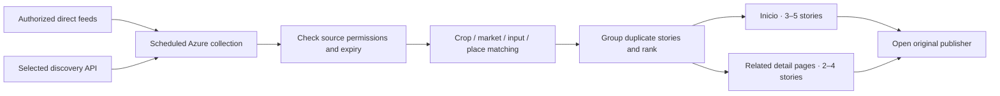

# News integration for AgroAmigo

Research checked 7 September 2026, America/Los_Angeles (8 September UTC). This is a product and procurement assessment, not a legal clearance of a particular feed. No subscriptions were purchased, providers contacted, or news ingestion enabled. The user accepts headlines and attribution without thumbnails.

## Recommended decision

Start with **headline + publisher + publication date + direct article link**, in Spanish, using sources with an established basis for that display. Treat thumbnails as optional, enabled only when the relevant rights are documented. A compact text feed also suits rural mobile connections.

Use a combination of permissioned specialist/official sources and an aggregator. Trial **NewsData.io's free tier** for discovery before committing to a paid service. If better entity matching, event grouping and custom source coverage justify a subscription, **NewsAPI.ai / Event Registry** is the first paid technical candidate to evaluate, at USD 90/month. It explicitly does not provide third-party publishing rights; its terms also require clarification of public display and the app's use of derived metadata. This is a conditional technical recommendation, not a finding that its Colombian agricultural coverage is best.

For clearly licensed publisher material, prioritize an agreement with **Editorial La República / Agronegocios**. Ask **Colprensa** for an alternative national/regional news and photo package. Those conversations address rights that a generic aggregator subscription usually does not purchase. Prices and exact coverage require quotes.

## Access and publication rights are separate

The relevant questions are whether a service can retrieve an article, whether AgroAmigo may display its headline, whether it may show a photograph, and whether it may store and classify that material. An image URL or an RSS feed does not itself establish all those permissions. Attribution is necessary in many arrangements but does not replace a license or a valid legal exception.

Colombian law distinguishes reporting facts from copying protected expression. Ley 23/1982, articles 31–34, addresses quotation and news/current events. Andean Decision 351 protects expression and photographs; its articles 21–22 constrain exceptions and include conditions concerning reserved reproduction rights. These provisions do not support a blanket statement that every headline, excerpt or small photograph can be reused in a commercial app. The application to this exact feed should be reviewed under Colombian law and any relevant distribution jurisdictions. [Ley 23](https://www.suin-juriscol.gov.co/viewDocument.asp?ruta=Leyes%2F30035790), [Decision 351, DNDA](https://www.derechodeautor.gov.co/es/decision-andina), [Berne Convention as promulgated in Colombia, WIPO](https://www.wipo.int/wipolex/en/legislation/details/10130).

Publisher restrictions matter in practice. Agronegocios requires prior written authorization for reproduction. FNC's published terms restrict commercial reuse and automated copying, and request authorization for deep links. MinAgricultura also reserves rights in its website content. These are the publishers' stated terms, not an independent determination of the enforceability of every clause. They make these sources candidates for permission or a source-specific legal review, rather than automatically reusable government/guild news. [Agronegocios terms](https://www.agronegocios.co/aviso-legal), [FNC terms](https://federaciondecafeteros.org/terminos-y-condiciones-de-uso-contenido-web/), [MinAgricultura terms](https://www.minagricultura.gov.co/terminos-y-condiciones).

Do not assume reducing a photo's size, hotlinking it, or obtaining it from `og:image` clears its rights. NewsData.io's homepage makes inconsistent image statements: one answer excludes image publication, while another suggests small thumbnails avoid copyright concerns. Its legal terms expressly say it cannot authorize use of third-party content. Use the actual rights agreement, not that marketing assurance. [NewsData.io FAQ](https://newsdata.io/), [terms](https://newsdata.io/terms).

A licensed editorial photograph can be appropriate in a revenue-generating informational app without being licensed for advertising or product promotion. Colprensa distinguishes these uses. Ask specifically about a news card adjacent to product/market information, including cropping, resizing, credits and retention. [Colprensa licensing FAQ](https://www.colprensa.com/contacto-y-preguntas/).

## API shortlist

Prices are published monthly prices checked on the research date, in their original currencies, before applicable taxes. They are API access prices unless explicitly negotiated otherwise. Different providers count requests, tokens and returned articles differently.

| Option | Published entry option | Relevant capabilities | Material limitation and assessment |
| --- | --- | --- | --- |
| NewsData.io | Free: 200 credits/day, 10 articles/credit, 12-hour delay, commercial API use advertised. Basic: USD 199.99/month, 20,000 credits/month, 50 articles/credit, real-time access. | Country, language, keyword and source filtering. Public catalog contains useful Colombian business and regional outlets. | Best no-cost discovery pilot. Specialist coverage needs supplementation. Legal terms leave publisher rights with the customer and contain differing descriptions of internal/external use; obtain written clarification for public headline cards and caching. [Pricing explanation](https://newsdata.io/blog/pricing-plan-in-newsdata-io/), [terms](https://newsdata.io/terms). |
| NewsAPI.ai / Event Registry | USD 90/month: 5,000 tokens; a recent-article search typically costs one token and returns up to 100 articles. | Source, topic, concept, location and entity filters; event clustering, duplicate detection; custom source additions advertised. | Strongest fit on paper for matching crops, places and companies. No third-party publishing rights; clarify customer-facing cards, generated tags and storage in writing. Trial is evaluation only. [Plans](https://newsapi.ai/plans), [terms](https://newsapi.ai/terms). |
| GNews | Essential EUR 49.99/month: 1,000 requests/day, up to 25 articles/request, real-time. Free plan is development/testing. | Spanish and Colombia supported; Boolean queries; date and relevance ordering. | Reasonable simpler paid alternative, but its FAQ says source filtering is not supported. AgroAmigo would filter returned publishers itself, which cannot recover omitted stories. Reasonable performance caching is permitted; media rights remain the customer's responsibility. [Pricing](https://gnews.io/pricing), [FAQ](https://gnews.io/), [search documentation](https://docs.gnews.io/endpoints/search-endpoint), [terms](https://gnews.io/legal/terms-of-service). |
| World News API | Reporter USD 39/month, 500 points/day; point use depends on endpoint/options. | Advertises 211 Colombian sources, around 1,482 articles/day, country and source filters, source suggestions. These are vendor claims, not independently measured agriculture coverage. | Standard terms prohibit storing data, including derived/hashed forms. Even user-requested caching needs written permission and is limited to one hour. Poor fit for the proposed Azure news index unless amended. [Pricing](https://worldnewsapi.com/pricing/), [Colombia coverage](https://worldnewsapi.com/docs/news-sources/colombia-news-api/), [terms](https://worldnewsapi.com/terms/). |
| NewsAPI.org | Business USD 449/month, 250,000 requests/month; free plan development only. | Broad search with domain and Spanish-language filters. | Not the first purchase for this app: materially higher entry price without a demonstrated specialist coverage advantage or publisher-rights bundle. The Colombia marketing page advertises `country=co`, but current top-headlines documentation lists only `us`; verify in an authenticated trial. [Pricing](https://newsapi.org/pricing), [Everything endpoint](https://newsapi.org/docs/endpoints/everything), [Colombia page](https://newsapi.org/s/colombia-news-api), [top-headlines documentation](https://newsapi.org/docs/endpoints/top-headlines), [terms](https://newsapi.org/terms). |
| Direct publisher / Colprensa / EFE | Negotiated; no comparable public API package price verified. | Contract can specify exact headlines, links, images, platforms and storage rights. Colprensa offers subscription access to text/photos. EFE offers thematic and territorial content packages. | Best route when certainty of publication rights is the main purchase criterion. Confirm Colombian agricultural volume and automated delivery; do not assume an image subscription includes a news API. [Colprensa](https://www.colprensa.com/contacto-y-preguntas/), [EFE business products](https://efe.com/para-empresas/), [EFE current content](https://efe.com/current-news-content/). |

Other options reviewed: **NewsCatcher** has source enrichment and custom-source capabilities, but its standard news-service terms describe internal use and place copyright clearance on the client. Its published USD 50 Starter pricing concerns its Web Search product; do not represent that as the price of a licensed, public-facing News API. **Mediastack** also has public-display/redistribution restrictions in its standard terms. Neither is an obvious shortcut to a licensed consumer feed. [NewsCatcher pricing](https://www.newscatcherapi.com/pricing), [NewsCatcher terms](https://www.newscatcherapi.com/company/legal/terms-of-conditions), [Mediastack terms](https://mediastack.com/terms).

**GDELT** is useful free discovery infrastructure with domain and country queries, but is not a publisher syndication license. One live DOC API request in this investigation returned HTTP 429; this is not sufficient to judge overall reliability, but no successful live coverage measurement was obtained. Google News RSS and search scraping similarly should not be treated as a grant of publisher rights or a contracted production API. [GDELT DOC documentation](https://blog.gdeltproject.org/gdelt-doc-2-0-api-debuts/).

## Colombian coverage checks performed

I inspected all ten pages (100 rows) returned by NewsData.io's public Colombia source catalog used by its website. These are catalog listings, not authenticated article-query results or an exhaustive inventory of the provider's ingestion.

| Listed source | Relevant use in AgroAmigo |
| --- | --- |
| Portafolio; La República | Crop economics, exports, input costs, agribusiness and trade policy |
| La Patria; La Crónica del Quindío | Coffee-region developments |
| Diario del Huila; La Nación | Huila crops, coffee, weather and local transport |
| El Colombiano; El País (Colombia) | Antioquia and southwestern production/logistics |
| El Espectador; Caracol Radio | National coverage with topic and location filtering |

The returned catalog also included international publishers. Therefore its Colombia filter must not be interpreted as proof that every article concerns Colombian agriculture. The listed sources' `last_updated` fields showed 3 September 2026; that does not independently establish their real-time latency.

The public source search returned no match for `agronegocios`, `redagricola`, `contextoganadero`, `federaciondecafeteros` or `agrosavia`. A control search for `portafolio` succeeded. These are **unverified specialist sources**, not proven permanently absent sources. Ask for sample results or addition of these domains before subscribing. The catalog was reached through the provider's [source page](https://newsdata.io/news-sources); the public website endpoints used were `/web/v1/resources/country/source?country_code=co&page=1` through page 10 and the read-only search operation `/web/v1/resources/search`.

Direct-feed checks:

| Source | Technical result on research date | Publication-rights status |
| --- | --- | --- |
| [La Nación general RSS](https://www.lanacion.com.co/feed/) | HTTP 200, valid RSS, 10 items, newest dated 7 September 2026. | Permission for AgroAmigo republication not established by feed availability. |
| [La Nación economics RSS](https://www.lanacion.com.co/category/noticias-economia/feed/) | HTTP 200, valid RSS, 10 items, including Huila coffee-sector material. | Same limitation. |
| [Redagrícola RSS](https://redagricola.com/feed/) | HTTP 200, valid RSS, 10 items, newest dated 7 September 2026. Multicountry content needs geography filtering. | Reuse terms/permission need confirmation. |
| [FNC press releases](https://federaciondecafeteros.org/listado-noticias/) | Live website verified by direct HTTP. `/feed/` returned HTML, not an RSS document. | Published site terms require permission for relevant reuse; arrange an authorized delivery method. |
| [AGROSAVIA news](https://www.agrosavia.co/noticias) | Live listing, including crop research and regional work. | No news syndication license established. |
| [Agronet news](https://agronet.gov.co/noticias) | Live listing, including cacao buying references and rice-sector measures. | Confirm the applicable content license; access to government information is not automatically a photo-reuse license. |

No authenticated, side-by-side paid-provider query benchmark was possible with the access available. I therefore do not assert that any vendor has the objectively best Colombian agricultural recall.

## Sources to prioritize

Agronegocios / La República should be a priority permission request because the publisher already covers the app's exact concerns. Examples include [fertilizer market projections](https://www.agronegocios.co/mercados/las-proyecciones-de-los-precios-de-fertilizantes-para-2026-a-nivel-global-y-nacional-4323117) and [fertilizer import suppliers](https://www.agronegocios.co/agricultura/las-empresas-que-lideran-importacion-de-fertilizantes-dentro-del-mercado-colombiano-4371026). These demonstrate editorial fit, not API availability or permission.

Add FNC/Cenicafé for coffee, ICA for phytosanitary/seed/input announcements, AGROSAVIA for research, Agronet/UPRA/MinAgricultura for agricultural policy and published references, and regional outlets for local disruptions. The app should distinguish official notices, guild statements, research, independent reporting, opinion and sponsored content. Corporate/guild press releases can be useful without being presented as independent corroboration. [ICA news example: authorized seeds](https://www.ica.gov.co/noticias/ica-uso-semillas-autorizadas-desarrollo-agricola), [AGROSAVIA news](https://www.agrosavia.co/noticias), [Agronet](https://agronet.gov.co/noticias).

## Proposed product behavior

| Page | News module and relevance rule |
| --- | --- |
| Inicio | “Actualidad del campo”: 3–5 distinct important stories selected from relevant agriculture coverage, not the country's unfiltered top-headlines feed. Prioritize actionable policy, supply, transport, input and climate developments. |
| Product / café | “Noticias sobre este producto”: 2–4 current items matched to the crop family, sector and geography. Coffee can include Brazilian weather or international trade when the relevance is clear. Avoid treating a café/restaurant story as farm-coffee news. |
| Market detail | “Noticias de esta plaza y sus rutas”: exact market names/aliases plus city or route context. Distinguish Corabastos or a central mayorista from financial “markets.” Do not imply market-specific news when only regional context exists. |
| Insumo detail | Match ingredient, category and relevant brand/company. Include fertilizer supply/prices, authorized products, recalls and verified regulatory changes. Label company promotions separately; a research story is not a product approval. |
| Mi finca | Optional later: crop and municipality/department relevance. A municipal match should not imply a confirmed event at the farm pin. |

Each item shows the original permitted headline, publisher, publication date, relevant place/topic and **“Leer en [medio] ↗”**. An optional text label distinguishes “Comunicado oficial,” “Gremio,” “Investigación” or “Opinión.” Open the publisher's original page; preserve its paywall and attribution. Display an absolute date for older items and an expiry/status for official alerts.

Use a source-independent topic dictionary tied to existing product, market and insumo IDs. Normalize accents and synonyms, disambiguate words such as papa/café/mercado, apply a geography relevance check, and group syndicated duplicates. Prefer one source per event on the small home module, with publisher diversity. Hide an empty detail module instead of filling it with tangential or stale stories. No algorithm can manufacture fresh news about every individual variety or fertilizer SKU.

For a first pilot, review selected results editorially. Rank by concrete impact, entity match, geography, freshness, source quality and source diversity. A news headline must not silently change a reported price, crop budget or forecast, and co-occurrence with a price change does not demonstrate causation.

## Proposed integration and cost

Fetch on the server with protected API credentials. Cache and retain only within the contract. With permission, Azure can hold headline, canonical URL, publisher, publication/retrieval dates, source ID, topic mappings, rights basis, expiration and takedown state. Record evidence of permission internally. Do not automatically apply the app's archive-every-source-document behavior to copyrighted news articles or photographs. Any stored derived tags/hashes must also be allowed by the provider contract.

Illustrative workload: 20 query groups × 4 refreshes/day = **80 initial searches/day, approximately 2,400/month**. Pagination, retries, source lookups and analytics are additional. For recent article searches this is below the 5,000-token Event Registry entry allowance; it also fits the nominal NewsData.io free daily credit limit, although that tier's 12-hour delay remains. This is an assumption-based sizing example, not a measured production bill. Serving many users from an authorized shared cache avoids one external request per page view.

No long news archive is needed for this feature. Aim for recent story selection (for example seven days on Inicio and 30 days on detail pages), subject to licensing and actual publication volume. This is an editorial display window, not a claim that a vendor allows 30-day storage. Official weather, road and phytosanitary alerts should retain their primary-source freshness rules instead of depending on a delayed news feed.

## Selection and licensing questions

Before committing to a paid service, run the same 14-day evaluation against shortlisted providers and direct feeds, using at least coffee, cacao, rice, potato, plantain, avocado, maize, fertilizers, seed/plant health and named wholesale markets. Include several municipalities/departments and relevant international commodity stories. Compare against a manually assembled set of source URLs. Measure relevant unique stories, missed known articles, arrival delay, duplicate rate, broken/paywalled links, topic/geography errors and cost. Require proof that specialist domains are actually ingested; a large global source count is not that proof.

Ask the vendor and/or publisher for a written answer covering:

1. Public display of the complete original headline, publisher, author when supplied, date and direct article URL, in AgroAmigo web, iOS and Android, including commercial use and intended territories.
2. Whether the provider grants the necessary underlying rights or only discovery access; identify excluded sources and agency-owned material.
3. Scheduled collection, shared caching, retention, topic classification, duplicate grouping, derived metadata, attribution and permitted transformations.
4. If images are added: thumbnail dimensions, cropping/resizing, hosting/CDN, required credits, editorial versus promotional use, expiration and deletion.
5. Corrections, takedown delivery and what must be deleted after subscription termination.
6. Confirmed ingestion of the named Colombian outlets and official/specialist sources, source-addition timelines, quotas, overages and monthly cancellation.

Suggested request text, prepared but not sent:

> AgroAmigo es una aplicación informativa agropecuaria para Colombia, disponible en web, iOS y Android. Queremos mostrar el titular original, nombre del medio, fecha y enlace directo a la noticia. El lector abriría la publicación original; no reproduciríamos el cuerpo del artículo. ¿Pueden autorizar este uso público, incluido el uso comercial, y la obtención y conservación temporal de estos metadatos para clasificar las noticias por cultivo, mercado, insumo y región? Favor indicar cobertura de fuentes, atribución, plazo de conservación, restricciones, condiciones de retiro/corrección y precio. Opcionalmente, agradeceríamos una cotización separada para miniaturas con derechos de uso explícitos. Necesitamos distinguir la licencia de acceso al servicio de los derechos sobre el contenido de cada editor.

## Research limits

Sources were checked through primary documentation, publisher terms and public HTTP requests. NewsData.io serves its terms through a JavaScript page; the legal text was read from the public `TermsConditions-mVhPW76d.js` asset loaded by `/terms`. No private endpoint or API key was used. Provider statements are not treated as an independent legal opinion. Feed availability is recorded separately from reuse rights, and catalog inclusion separately from observed article coverage. Final vendor choice and any publishing authorization remain unverified until those narrower checks are completed.

## Follow-up: crawler with an AI relevance agent

The user proposed replacing the news API with an agent that monitors news sites. This is technically viable and a strong candidate for AgroAmigo's narrow subject area. It can target specialist publishers that a broad aggregator fails to cover. Whether it improves actual recall must still be measured. It substitutes our collection and maintenance work for the API subscription; it does not create publisher reuse rights.

Recommended design:

1. Maintain an approved source registry with allowed paths, discovery method, crawl frequency, headline-display rights, optional image rights and retention limits.
2. A scheduled collector checks RSS/Atom when available, followed by permitted section pages, sitemaps or structured article metadata. Use an identified crawler, per-domain throttling, backoff and caching where allowed. Do not bypass access restrictions or paywalls. A sitemap or permissive robots file is a discovery mechanism, not a content license. [Google's explanation of robots.txt](https://developers.google.com/search/docs/crawling-indexing/robots/intro).
3. Extract the publisher's title, canonical URL, date and publisher with deterministic validation. Fetch additional article text only when permitted and needed to resolve relevance; public display can remain headline-only.
4. Give a bounded AI classifier only the new candidate records and any permitted context. It assigns existing crop, market, insumo and location IDs, identifies opinion/promotional/official material, estimates relevance and groups candidate duplicate stories. It can abstain when a headline is ambiguous. External text is untrusted input and must never instruct the agent or gain access to credentials or publishing tools.
5. Apply source/rights rules, date checks, link validation and duplicate checks before selecting stories. Review uncertain results. Store permitted metadata and provenance in Azure and serve the same feed to web/iOS/Android.

This separates reliable scheduled collection from semantic interpretation. An unrestricted browser agent deciding where to navigate on every run would add cost, variability and testing difficulty. Browser rendering can remain an occasional permitted fallback for sites that require it.

For example, 20 sources checked four times daily produce 80 initial discovery requests/day, plus article fetches and retries. Only newly discovered stories require classification. This is an illustrative workload, not a cost quote. Costs consist of Azure execution, model inference and adapter maintenance; browser-heavy extraction and changing publisher layouts can dominate. Measure a small pilot before promising savings over a paid API.

The most important operational checks are last successful fetch per source, unexpected zero results, extracted-date validity, repeated/changed URLs and rejected or stale stories. A single broken source should not break the home page. The user-facing date should be the article's publication date, with update dates distinguished, rather than the time the crawler discovered it.

Rechecked publisher terms still constrain this approach: [Agronegocios](https://www.agronegocios.co/aviso-legal) reserves reproduction rights and [FNC](https://federaciondecafeteros.org/terminos-y-condiciones-de-uso-contenido-web/) explicitly restricts automated copying without written authorization. Include those sites only under an established permission or applicable legal basis. Retaining the original headline and attribution is useful, but neither assigning an AI agent nor rewriting a title removes those questions.

Recommended next implementation scope, if requested: an API-free pilot with 10–20 sources whose collection and headline-display basis is established, checking every six hours, showing 3–5 stories on Inicio and 2–4 on applicable details. Evaluate topical accuracy, coverage, maintenance and operating cost before expanding. This follow-up documents the design only; no crawler or external scheduled job has been created.

## Follow-up: live Gemini and Azure GPT experiments

The user subsequently authorized experiments using their Gemini API key and Visual Studio Azure subscription. The [experiment report](research/news-model-benchmark/README.md) contains the fixed Spanish cases, prompt, raw model outputs, token usage, account/quota findings and reproducible runner. These were authored synthetic cases, not a real-news coverage evaluation. No publisher content was republished.

For the first pilot, **Gemini 3.8 Flash with low thinking is the provisional quality choice; Azure GPT-4.1 mini is a credible cheaper alternative**. On the same 32 cases repeated twice, Flash matched relevance, topics and geography on 64/64 responses; GPT-4.1 mini matched 56/64. Their measured usage projects to about $1.99 versus $0.73 per 10,000 similarly batched headlines, excluding hosting and source rights. Gemini 3.8's introductory pricing runs through December 2026; the same usage would cost about $3.99 from January 2027 at Google's announced rates. Gemini 3.1/3.5 Flash-Lite, 3.5 Flash and Azure GPT-5 mini were also tested. This small, prompt-specific experiment does not establish a general model ranking or production accuracy. [Google pricing](https://ai.google.dev/gemini-api/docs/pricing).

The current account could not generate with Gemini 2.5 Flash-Lite despite its catalog listing. Azure nano/Luna real-time quota was zero, but GPT-4.1 mini and GPT-5 mini deployed and ran successfully. Azure's filter blocked the batch containing artificial prompt-injection cases, so it was excluded from every model's shared-case comparison and retained in the failure records. The experiment's estimated inference cost was under $0.10 at published rates. The temporary Azure account and deployments were removed afterward; no crawler or recurring job was installed.

Visual Studio credits can fund Azure OpenAI for eligible development/test use, but remaining credits were not verified and production use requires an appropriate paid subscription. See [Microsoft credit eligibility](https://learn.microsoft.com/en-us/visualstudio/subscriptions/vs-azure-eligibility) and the [offer terms](https://azure.microsoft.com/en-us/pricing/member-offers/credit-for-visual-studio-subscribers/). Paying for a model, using an agent or holding Azure credits still does not establish rights to reuse a publisher's headlines or photographs.

The user clarified the preferred design as **one daily fetching and classification job**, replacing the earlier four-refreshes-per-day proposal. The [ongoing Gemini cost estimate](research/news-model-benchmark/COST_ESTIMATE.md) sizes 100–1,000 new classifications per daily run. At 200–500/day, allow about $10–$25/month for inference when some stories need excerpts; similarly batched headline-only classification projects to about $1.20–$3.00/month. Hosting and rights are separate, and Google's announced January 2027 pricing doubles these amounts at unchanged usage. The [36-region Azure quota audit](research/azure-ai-quota/README.md) confirms no positive Luna real-time quota and records the available GPT, speech, embedding and open-model alternatives.

## Observed source volume

The user asked how many stories the identified sources actually publish. The [publication-volume audit](research/news-volume/README.md) counted **86 dated items across seven measurable feeds/sections during August 24–September 6**, averaging **6.14/day**, with combined daily counts from 1 to 15. This excludes the still-in-progress September 7. The feeds are La Nación Economía, Redagrícola (all countries), Portafolio Agro, ICA, AGROSAVIA, UPRA and Agronet. Counts precede topical filtering and cross-publisher event deduplication; Redagrícola's Colombia category had one of its 19 items, not 19 Colombia-specific stories.

The wider publisher set remains partially unmeasured, including Agronegocios/La República, CONtexto Ganadero and several general/regional outlets. The seven-feed subtotal must not be presented as the complete source-list total. The earlier 200–500 candidates/day was a budgeting assumption, not an observed rate. At the measured core-only rate, the earlier 1,000-input/200-output-token scenario projects to roughly $0.28/month in Gemini inference at current prices, with hosting and rights separate.
